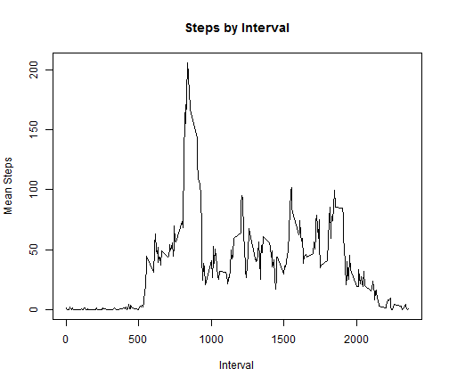
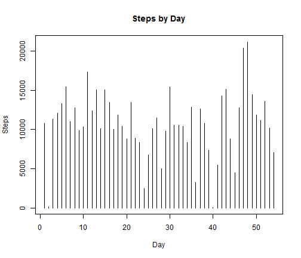
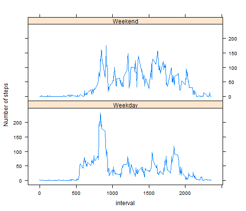

# Reproducible Research - Peer Assessment 1
# ~~~~~~~~~~~~~~~~~~~~~~~~~~~~~~~~~~~~~~~~~

## Loading and pre-processing data

The first section of the program loads the relevant libraries, reads the data file into variable data.  
It them uses the aggregate function to sum up the total number of steps by date.


```r
library(lattice)
```

```
## Warning: package 'lattice' was built under R version 3.0.3
```

```r
data <- read.csv("activity.csv", stringsAsFactors = FALSE)
hist_data <- aggregate(steps ~ date, data = data, sum)
hist_data <- transform(hist_data, date = factor(date))
```


## What is mean total number of steps taken per day?

The first plot, along with the mean and median calculations, which shows steps over time is as follows:


```r
with(hist_data, plot(as.numeric(date), steps, type = "h", xlab = "Day", ylab = "Steps", 
    main = "Steps by Day"))
```

 

```r
print(paste("Mean Steps : ", mean(hist_data$steps)))
```

```
## [1] "Mean Steps :  10766.1886792453"
```

```r
print(paste("Median Steps : ", median(hist_data$steps)))
```

```
## [1] "Median Steps :  10765"
```


## What is the average daily activity pattern?

The second plot shows average steps for a time interval. The most active interal is also shown below :


```r
interval_data <- aggregate(steps ~ interval, data = data, mean)
with(interval_data, plot(interval, steps, type = "l", xlab = "Interval", ylab = "Mean Steps", 
    main = "Steps by Interval"))
```

 

```r
print(paste("Most active interval :", interval_data$interval[interval_data$steps == 
    max(interval_data$steps)]))
```

```
## [1] "Most active interval : 835"
```


## Imputing missing values

We compute the number of rows with NA. Thereafter we will populate the NA's with the mean number of steps corresponding to the time intervals in the previous exercise and place this is a new dataset called final_data.


```r
print(paste("Number of rows with NAs :", sum(!complete.cases(data))))
```

```
## [1] "Number of rows with NAs : 2304"
```

```r
final_data <- data
final_data$steps[is.na(data$steps)] <- interval_data$steps[data$interval == 
    interval_data$interval]
```

```
## Warning: number of items to replace is not a multiple of replacement
## length
```


We generate another aggregate called fin_hist_data and plot the graph of steps over days.Note that the results in the mean being unchanged, but the median being changed because of the strategy we employed to replace the NAs in the dataset.


```r
fin_hist_data <- aggregate(steps ~ date, data = final_data, sum)
fin_hist_data <- transform(fin_hist_data, date = factor(date))
with(fin_hist_data, plot(as.numeric(date), steps, type = "h", xlab = "Day", 
    ylab = "Steps", main = "Steps by Day"))
```

 

```r
print(paste("Mean Steps (after adjustment) : ", mean(fin_hist_data$steps)))
```

```
## [1] "Mean Steps (after adjustment) :  10766.1886792453"
```

```r
print(paste("Median Steps (after adjustment) : ", median(fin_hist_data$steps)))
```

```
## [1] "Median Steps (after adjustment) :  10765.5943396226"
```


## Are there differences in activity patterns between weekdays and weekends?

To create the final plot, we need a new column called days. We start with a POSIXlt date then populate teh days column with the weekday of the record. We then convert the days to a weekday/weekend designation. When the data is ready, we use aggregate() to generate the means based on days then use the xyplot() p create the final graph.

From the graph, there are clear differences between the weekday activity and weekend activity.Weekdays have a higher peak activity but weekends with more activity across the time intervals.


```r
final_data$date <- strptime(data$date, "%Y-%m-%d")
final_data$day <- weekdays(final_data$date)
final_data$day[final_data$day == "Monday"] <- "Weekday"
final_data$day[final_data$day == "Tuesday"] <- "Weekday"
final_data$day[final_data$day == "Wednesday"] <- "Weekday"
final_data$day[final_data$day == "Thursday"] <- "Weekday"
final_data$day[final_data$day == "Friday"] <- "Weekday"

final_data$day[final_data$day == "Saturday"] <- "Weekend"
final_data$day[final_data$day == "Sunday"] <- "Weekend"

final_data <- transform(final_data, day = factor(day))

final_interval_data <- aggregate(steps ~ interval + day, data = final_data, 
    mean)
print(xyplot(steps ~ interval | day, final_interval_data, layout = c(1, 2), 
    type = "l", ylab = "Number of steps"))
```

 

